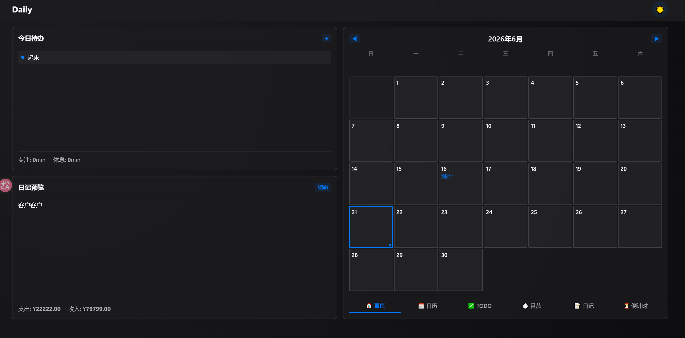

# simple-daily-termux — 个人日常管理工具

[简体中文](README_ZH.md) | [English](README.md)

[](https://github.com/lost-clouds/simple-daily-termux/actions/workflows/ci.yml)

轻量级个人时间管理应用，Go 后端 + 原生 JavaScript SPA 前端，编译为单个二进制文件。提供 **TODO 待办**、**番茄钟**、**日记记账**、**日历聚合**、**倒计时** 五大功能模块。可与 [Blog-termux](https://github.com/lost-clouds/Blog-termux) 通过 nginx 反代联动，在仪表盘首页展示日常概览卡片。

> 为 Android Termux 环境而生。纯 Go（零 CGO），单二进制部署，约 15MB。



---

## 目录

- [快速开始](#快速开始)
- [技术架构](#技术架构)
- [模块说明](#模块说明)
- [部署教程](#部署教程)
  - [独立部署](#独立部署)
  - [与 Blog-termux 联动](#与-blog-termux-联动)
- [API 参考](#api-参考)
- [配置文件](#配置文件)
- [使用指南](#使用指南)
- [开发指南](#开发指南)
- [常见问题](#常见问题)

---

## 快速开始

**方式 A — 下载预编译包（推荐）：**

```bash
# 支持 linux-amd64 / linux-arm64 / linux-armv7
curl -sSLO https://github.com/lost-clouds/simple-daily-termux/releases/latest/download/simple-daily-termux-linux-arm64.tar.gz
tar -xzf simple-daily-termux-linux-arm64.tar.gz
```

**方式 B — 从源码编译（需要 Go 1.22+）：**

```bash
git clone https://github.com/lost-clouds/simple-daily-termux.git
cd simple-daily-termux
bash web/css/build.sh    # 构建 CSS
go build -o simple-daily-termux .
```

**启动：**

```bash
cp config.example.json config.json
# 按需编辑 config.json
./simple-daily-termux config.json
# → http://127.0.0.1:8090
```

**验证：**

```bash
bash scripts/smoke.sh          # 12 项 API 检查
# 全部 PASS 即可使用
```

> 当前版本：[v0.0.2](https://github.com/lost-clouds/simple-daily-termux/releases/tag/v0.0.2)

---

## 技术架构

| 层级 | 技术选型 |
|------|----------|
| 语言 | Go 1.22+ |
| HTTP | `net/http` 标准库（`http.ServeMux` 模式路由，零框架） |
| 数据库 | SQLite（`modernc.org/sqlite`，纯 Go 零 CGO）/ MySQL 可选 |
| 前端 | 原生 ES Modules（无打包器）、CSS 自定义属性（cat 合并）、`marked.js` |
| 静态资源 | `go:embed` — 前端嵌入二进制 |
| 进程管理 | PID 文件 + `start.sh` / `stop.sh`（不依赖 systemd） |

### 模块依赖图

```
main.go
  ├── config.Load()
  ├── sqlstore.NewSQLite() / NewMySQL()          → Store
  ├── ledger.NewService(st.Ledgers(), st.Settings())
  ├── countdown.NewService(st.Countdowns())
  ├── todo.NewService(st.Todos(), countSvc)       ← 注入 countdown 做 deadline 联动
  ├── pomodoro.NewService(st.Pomodoros())
  ├── diary.NewService(st.Diaries(), ledgerSvc)   ← 注入 ledger 做代码块解析
  ├── calendar.NewService(st.Calendars(), st.Todos(), st.Countdowns(), st.Diaries())
  ├── summary.NewService(ledgerSvc, countSvc, pomoSvc, timezone)
  └── http.ServeMux → 各模块注册各自路由
```

---

## 模块说明

### 首页

三栏布局：左栏（今日待办 + 日记预览），右栏（日历网格 + 倒计时事件预览）。点击日历日期切换左侧对应日期的内容。

- 待办面板底部显示今日专注/休息分钟
- 日记面板底部显示当日收支
- 日历格子内预览倒计时事件标题（超长截断为 `…`）
- 每日/长期任务自动实例化（`POST /api/todos/ensure-daily`）

### TODO 待办

| 字段 | 说明 |
|------|------|
| `task_type` | `daily`（每日自动创建）/ `long_term`（截止期内每日自动创建）/ `one_time`（手动一次性） |
| `priority` | 自动计算：I 级（🔴 <14天）/ II 级（🟠 14-30天）/ III 级（🟡 30-60天）/ IV 级（🔵 ≥60天） |
| `deadline_at` | 驱动倒计时联动 — 设置/清除时自动同步倒计时事件 |

### 番茄钟

- 大号计时器（PC 5rem，响应式缩放）
- 开始专注 → 倒计时 → 完成弹出浅蓝磨砂蒙版 → 点击开始休息计时
- 专注/休息时间分开累积
- 切 Tab 不中止 session，后台继续运行

### 日记 + 记账

- PC 端左右结构（Markdown 编辑器 | 渲染预览）
- Markdown 使用 `marked.js` + 自定义 ledger 代码块样式
- 日记中 `` ```ledger ... ``` `` 代码块在保存时自动同步到记账（幂等）
- 独立记账：类别下拉选择（工资/餐饮/交通/购物/缴费/副业/其他）
- 月度汇总：支出、收入、结余、累计储蓄

### 日历

- 月视图网格，每个格子显示该日倒计时事件和待办截止日
- 有日记的日期右下角蓝色小点标记
- 独立日历全页视图

### 倒计时

- 手动创建 + Todo 自动派生
- `days_left` 读取时实时计算
- ≤7 天红色紧急样式

---

## 部署教程

### 独立部署

**1. 编译：**

```bash
git clone https://github.com/lost-clouds/simple-daily-termux.git
cd simple-daily-termux
bash web/css/build.sh
go build -o simple-daily-termux .
```

**2. 配置：**

```bash
cp config.example.json config.json
```

默认 SQLite 数据库 `./data/daily.db`，监听 `127.0.0.1:8090`。

**3. 运行：**

```bash
# 手动
./simple-daily-termux config.json

# 后台守护
bash scripts/start.sh
bash scripts/stop.sh
```

**4. 冒烟测试：**

```bash
bash scripts/smoke.sh
```

**5.（可选）Nginx 反代：**

参考 [example/standalone.conf](example/standalone.conf)。

### 与 Blog-termux 联动

**Step 1 — 部署 simple-daily-termux**（参考独立部署）。

**Step 2 — 添加 nginx 反代规则：**

将 [example/integration.conf](example/integration.conf) 的内容添加到 Blog-termux 的 nginx `server {}` 块中。添加两个 location：

- `/simpledaily/` → 反代到 Go SPA
- `/api/summary` → 仪表盘卡片数据端点

**Step 3 — 部署集成文件：**

```bash
cp web/blog-termux-index.html /path/to/Blog-termux/index.html
```
summary 卡片组件已内联到 HTML 中，无需额外部署 JS 文件。

**Step 4 — 重载 nginx：**

```bash
nginx -s reload
```

Blog-termux 仪表盘首页出现"日常概览"卡片（第一行第一列），点击跳转到完整 SPA。

---

## API 参考

所有响应格式：`{"ok": true, "data": ...}` 或 `{"ok": false, "error": "..."}`

| 方法 | 路径 | 说明 |
|------|------|------|
| GET | `/api/todos` | 列表（`?status=&task_type=&entry_date=`） |
| POST | `/api/todos` | 创建 |
| GET | `/api/todos/{id}` | 详情 |
| PUT | `/api/todos/{id}` | 更新 |
| DELETE | `/api/todos/{id}` | 删除 |
| POST | `/api/todos/ensure-daily` | 实例化每日/长期任务到指定日期 |
| GET | `/api/countdown` | 列表 |
| POST | `/api/countdown` | 创建手动倒计时 |
| DELETE | `/api/countdown/{id}` | 删除 |
| POST | `/api/pomodoro/start` | 开始专注 |
| POST | `/api/pomodoro/start-rest` | 开始休息 |
| POST | `/api/pomodoro/{id}/finish` | 结束（`{"status":"completed\|aborted"}`） |
| GET | `/api/pomodoro/today` | 今日专注+休息分钟 |
| GET | `/api/diary/{date}` | 获取日记（date=YYYY-MM-DD） |
| PUT | `/api/diary/{date}` | 保存（触发记账同步） |
| GET | `/api/diary` | 月列表（`?month=YYYY-MM`） |
| GET | `/api/ledger` | 记账列表（`?month=YYYY-MM`） |
| GET | `/api/ledger/{id}` | 详情 |
| GET | `/api/ledger/summary` | 月度汇总（`?month=YYYY-MM`） |
| POST | `/api/ledger` | 创建 |
| DELETE | `/api/ledger/{id}` | 删除 |
| PUT | `/api/settings/{key}` | 设置 KV（`{"value":"..."}`） |
| GET | `/api/calendar` | 聚合月视图（`?month=YYYY-MM`） |
| POST | `/api/calendar/events` | 创建事件 |
| PUT | `/api/calendar/events/{id}` | 更新事件 |
| DELETE | `/api/calendar/events/{id}` | 删除事件 |
| GET | `/api/summary` | 集成卡片数据 |
| GET | `/api/health` | 健康检查 |

---

## 配置文件

```json
{
  "server": {
    "addr": "127.0.0.1:8090",
    "cors": false
  },
  "database": {
    "driver": "sqlite",
    "sqlite": { "path": "./data/daily.db" },
    "mysql": { "dsn": "user:pass@tcp(host:3306)/daily?parseTime=true" },
    "timezone": "Local"
  }
}
```

| 字段 | 默认值 | 说明 |
|------|--------|------|
| `server.addr` | `127.0.0.1:8090` | 监听地址 |
| `server.cors` | `false` | 开发时开启 CORS |
| `database.driver` | `sqlite` | `sqlite` 或 `mysql` |
| `database.sqlite.path` | `./data/daily.db` | SQLite 文件路径 |
| `database.timezone` | `Local` | 番茄钟"今日"计算的时区 |

---

## 使用指南

| 操作 | 方法 |
|------|------|
| **首页** | 日历 + 今日待办 + 日记预览。点击日历日期切换内容 |
| **创建每日任务** | TODO 页 → 类型选"每日" → 每天自动生成 |
| **创建长期任务** | TODO 页 → 类型选"长期" + 截止日 → 截止日前每天自动生成 |
| **开始番茄钟** | 番茄钟页 → 选时长 → 开始。完成弹蒙版 → 点击开始休息 |
| **写日记** | 日记页 → 选日期 → 写 Markdown。ledger 代码块自动同步到记账 |
| **记账** | 日记页 → "+ 记账" → 下拉选类别 → 输金额 → 保存 |
| **设置期初储蓄** | `curl -X PUT http://127.0.0.1:8090/api/settings/opening_savings_cents -d '{"value":"5000000"}'` |
| **深色模式** | 点击 🌓 按钮 |

---

## 开发指南

```bash
# 构建 CSS（修改 src/*.css 后）
bash web/css/build.sh

# 编译
go build -o simple-daily-termux .

# 交叉编译（零 CGO）
GOOS=linux GOARCH=arm64 go build -o simple-daily-termux .

# 测试
bash scripts/smoke.sh

# CI（push/PR 自动触发）
# 见 .github/workflows/ci.yml
```

### 设计原则

- **Go 零包级可变状态** — 全部依赖构造函数注入，导出/非导出可见性强制模块边界
- **ES Module 作用域隔离** — 每个 JS 文件独立模块，无全局命名空间污染
- **CSS tu- 前缀** — 所有自定义类名前缀 `tu-`，嵌入 Blog-termux 时不冲突
- **金额整数分存储** — `amount_cents int64`，前端边界转换

---

## 常见问题

**Q: 如何设置期初储蓄？**

```bash
curl -X PUT http://127.0.0.1:8090/api/settings/opening_savings_cents \
  -H 'Content-Type: application/json' \
  -d '{"value":"5000000"}'
# 5,000,000 分 = ¥50,000.00
```

**Q: 每日任务不显示？**

首页加载时会调用 `POST /api/todos/ensure-daily` 自动创建当天实例。若不显示，检查浏览器控制台错误。

**Q: 从 SQLite 切换到 MySQL？**

编辑 `config.json`：`driver` 改为 `mysql`，提供 `mysql.dsn`。重启即可，表自动创建。已有 SQLite 数据需手动迁移。

**Q: Blog-termux 仪表盘卡片显示 "--"？**

1. simple-daily-termux 是否运行？`curl http://127.0.0.1:8090/api/health`
2. nginx 反代规则是否添加？`curl http://127.0.0.1:7443/api/summary`
3. `blog-termux-index.html` 是否已部署？

**Q: 通过 nginx 访问 CSS/JS 加载失败？**

SPA 使用相对路径。确保 nginx 有 `location /simpledaily/ { proxy_pass http://127.0.0.1:8090/; }`。

---

## Links

- [Blog-termux](https://github.com/lost-clouds/Blog-termux) — 联动仪表盘项目
- [Linux.do](https://linux.do)
